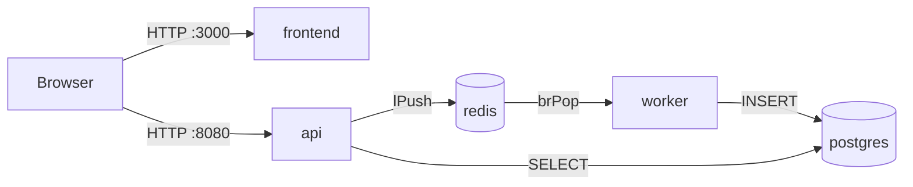

# Arhitektura projekta

## Servisi i uloge

| Servis   | Uloga                                       | Tehnologija  |
| -------- | ------------------------------------------- | ------------ |
| frontend | Statičko web sučelje, izlaže `/config`    | Node/Express |
| api      | REST endpointi za događaje i narudžbe     | Node/Express |
| worker   | Preuzima narudžbe iz reda i upisuje u bazu | Node         |
| postgres | baza podatak narudžbi                      | PostgreSQL   |
| redis    | Red poruka između API-ja i workera         | Redis        |

Worker je namjerno odvojen od API-ja jer kupnja karata ne može čekati bazu podatak da dovrši upis. API validira zahtjev, stavlja ga u Redis red i vraća 202 (primljeno), nakon toga ga worker preuzima iz Redis reda i upisuje u bazu. Time se API u slučaju velikoga prometa manje opterećuje, upravo zbog reda koji apsorbira zahtjeve prema bazi. Bitno je u produkciji staviti ograničenje memorije za Redis servis.

## Međuservisna komunikacija

Frontend ne komunicira s API-jem. On poslužuje statiku i /config, preko kojeg preglednik dobiva URL za slajnje podaka na API.

Detaljni scenariji kvarova i postupci oporavka: [runbook](runbook.md).

## Kontejneri u odnosu na alternative

Svaki servis aplikacije vrti se u vlastitom kontejneru. Arhitektura je
postavljena tako zbog jednostavnijeg i bržeg skaliranja worker servisa:
broj workera određuje se prema dužini Redis reda. Kada bismo govorili o
VM produkciji, skaliranje bi značilo pokretanje nove mašine na
poslužitelju, dodatni operacijski sustav koji se mora održavati i
dugotrajno pokretanje. Nadalje, mogućnost različitih okruženja na istom
poslužitelju i jednostavnost ažuriranja servisa idu u prilog
kontejnerizaciji.

Međutim, baza podataka zahtijeva trajni volumen, pa je u produkciji
poželjnije postaviti je na virtualnu mašinu. Također treba uzeti u obzir
sigurnosni aspekt: virtualne mašine nude jaču izolaciju vlastitim
kernelom, dok kontejneri dijele kernel hosta. Kontejnerizacija uz to
donosi i dodatni trošak poput registra slika i orkestratora.

## Usklađenost s ciljevima projekta

Za produkcijsko i testno okruženje slike kontejnera su iste — razlikuje
se samo konfiguracija koja dolazi iz okoline. HTTP endpoint `/config`
pregledniku vraća `apiBaseUrl`, preko kojeg preglednik dalje šalje
zahtjeve API-ju. Svaki servis je zasebna slika, čime dobivamo manju
površinu napada i jednostavniji uvid u sigurnost pojedinih servisa.
Nadalje, verzioniranje je podijeljeno po servisu umjesto na razini
cijele aplikacije.

Frontend, api i worker su stateless servisi, pa se skaliraju neovisno o
stanju drugih i podnose rolling update bez gašenja ostatka platforme.
Pritom svaki servis izlaže `/healthz` i `/readyz`, a logovi ostaju
zasebni po servisu, što omogućuje agregaciju i filtriranje po servisu.
Time se dobiva uvid u stanje platforme i pojedinih servisa te brza
reakcija u slučaju kvara.

