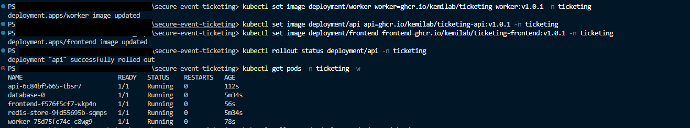
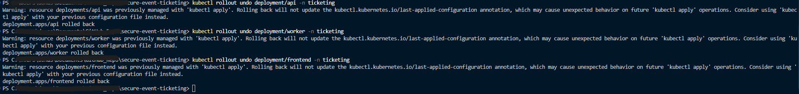

# Deployment u produkcijsko okruženje

Upute za podizanje aplikacije na Kubernetes klaster

## Preduvjeti

- `kubectl`
- Docker slike objavljene u `ghcr.io/kemilab/` i **javno dostupne**

Provjera:

```
kubectl get nodes
```

### Unos u hosts datoteku

Ingress je vezan na host `ticket.local`.

Windows, `C:\Windows\System32\drivers\etc\hosts`
```
127.0.0.1 ticket.local
```

Linux i macOS, `/etc/hosts`

Ako se aplikacija posjećuje sa ` localhost, 127.0.0.1, ect ` ingress neće pravilno raditi!
## Postupak

### 1. Ingress controller

Ingress controller se instalira prilikom `apply` komande
i nije ga potrebno dodatno konfigurirati

### 2. Tajne

Prije početka, potrebno je kopirati primjerak SecretsConfig
kako bi pods dobili ispravane lozinke

```
cp k8s/02-secrets-example.yml k8s/02-secrets.yml
```

### 3. Ostali manifesti

```
kubectl apply -f k8s/
```

Datoteke generalno sljede preodređeni
raspored primjene. Prikazan dolje.

| Redoslijed | Sadržaj |
|---|---|
| `00` | Namespace |
| `01`, `02` | ConfigMap, Secret, inicijalizacijska SQL skripta |
| `04`, `05` | Ingress controller i Ingress pravila |
| `10`, `20` | Postgres, Redis |
| `40`, `50`, `60` | api, frontend, worker |
| `70` | NetworkPolicy |
| `80` | ServiceAccount |

Generalno nije potrebno mijenjati redosljed.
Ako je to ipak nužno, ostaviti `00-Namespace.yml`
kako prvi manifest!

## Provjera

```
kubectl get pods -n ticketing
kubectl get svc,ingress -n ticketing
kubectl get networkpolicy -n ticketing      # očekuje se 5 politika
```

Svi podovi moraju biti `Running` i `1/1` u stupcu READY.

Provjera cijele putanja podatak se nalaz u [/README.md](README.md)

```
curl http://ticket.local/api/healthz
curl http://ticket.local/api/readyz
curl http://ticket.local/api/events

curl -X POST http://ticket.local/api/tickets/purchase \
  -H "Content-Type: application/json" \
  -d '{"eventId":"evt-1001","customerEmail":"student@example.com","quantity":2}'

curl http://ticket.local/api/tickets/orders
```

Sučelje je dostupno na `http://ticket.local/`.

## Rolling update i rollback

Deployment postupno zamjenjuje podove: diže novi, čeka da prođe readiness
probu, pa tek onda gasi jedan stari. Zbog toga neispravna verzija ne uzrokuje
prekid rada, nego samo zaustavi rollout.

Nova verzija:

```
kubectl set image deployment/api api=ghcr.io/kemilab/ticketing-api:v<release_tag>-n ticketing
kubectl rollout status deployment/api -n ticketing
```

Povijest i povratak:

```
kubectl rollout history deployment/api -n ticketing
kubectl rollout undo deployment/api -n ticketing
kubectl rollout undo deployment/api --to-revision=2 -n ticketing
```
## Primjeri




Napomena:

Manifesti koriste `sha-` tag za deployment. Razlog je idempotentnost 
slika koje se rade prilikom releasea.

## Arhitektura podova

### Postgres kao StatefulSet

Baza je jedini servis sa stanjem. StatefulSet kroz `volumeClaimTemplates` 
kreira trajni volumen, i omogućuje da se kod vraćanja poda nazad u kluster
ona vrati pod istim imenom. 

Stateless servisi (api, frontend, worker) idu kao Deploymenti jer nas ne zanima njihovo stanje i ime

### Probe

| Servis | liveness | readiness |
|---|---|---|
| postgres | `pg_isready` | `pg_isready` |
| api | `/healthz` | `/readyz` |
| redis | — | `redis-cli ping` |
| frontend | `/healthz` | — |
| worker | — | — |

Liveness (`healthz`) - ukoliko pod ne da odogovor u odrđenom roku 
biti će ponovno pokrentu
Readiness (`readyz`) - ukoliko pod ne da odgovor u određenome roku
biti će uklonjen, dok ne da odovor da je spreman

**Worker** je ovdje iznimka. Sama slika nema probe, 
pa se njega nema na temelju čega ispitati da li je spreman.
 - runbook (S7).

### Konfiguracija i tajne

Konfiguracija dolazi iz ConfigMapa kroz `envFrom`, a lozinka iz Secreta kroz
`secretKeyRef`. 
Dodavanjem nove tajne u Secret ne dobivaju je automatski svi servisi!

Secret nije šifriran, nego samo base64 kodiran. 
### Mrežna segmentacija

| Servis | Prima promet od | Port |
|---|---|---|
| frontend | ingress-nginx | 3000 |
| api | ingress-nginx | 8080 |
| postgres | api, worker | 5432 |
| redis | api, worker | 6379 |
| worker | — | — |

Frontend prima promet samo od controllera jer njegov server nikad ne zove api — sve
pozive prema API-ju radi preglednik. Worker ne prima ništa jer nema ni Service
ni izložen port.

### ServiceAccount i RBAC

Nijedans servis nema potrebe na Service Account tokenom, pa zato se token ne dodjeljuje nitijednome poddu.

Iznimka je `04-ingress-controller.yml` kojiima ServiceAccount, jer mora čitati Ingress objekte.

## Uklanjanje

```
kubectl delete -f k8s/
```

PVC se **ne briše** s StatefulSetom — podaci baze preživljavaju. Za potpuno
uklanjanje uključujući podatke:

```
kubectl delete namespace ticketing
```

Prije toga, ako podaci trebaju:

```
kubectl exec database-0 -n ticketing -- \
  pg_dump -U ticketing_user ticketing > backup.sql
```

Postupci dijagnostike i oporavka opisani su u [runbooku](runbook.md).
